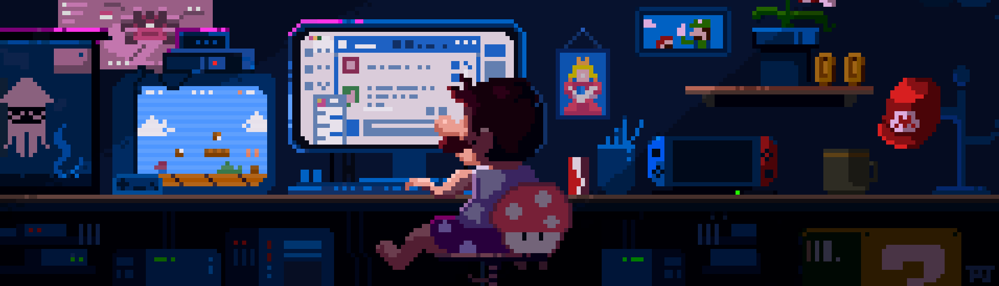

  

<h1 align="center">Hey 👋, I'm Sergiy</h1>

  
  
  

---

## 👨‍💻 About me

I'm a **42 Lisboa** student, currently building a solid foundation in **C** and **systems programming**, while exploring different areas to find where I want to specialize.

- 🎓 Cadet at **42 Lisboa**
- 🎮 In love with **game development** — it's what I want to do with my life
- 🧠 Exploring engines and tools to bring that goal closer, alongside my systems programming background
- 🚀 Long-term goal: build and ship my own games

---

## 🎮 Right Now

Working on my **first game**: **[One Night Alone](https://github.com/SergioHawky/One_Night_Alone)**

---

## 🛠️ Skills

**Languages**

**Tools & Engines**

